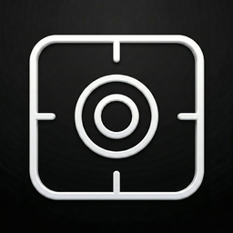
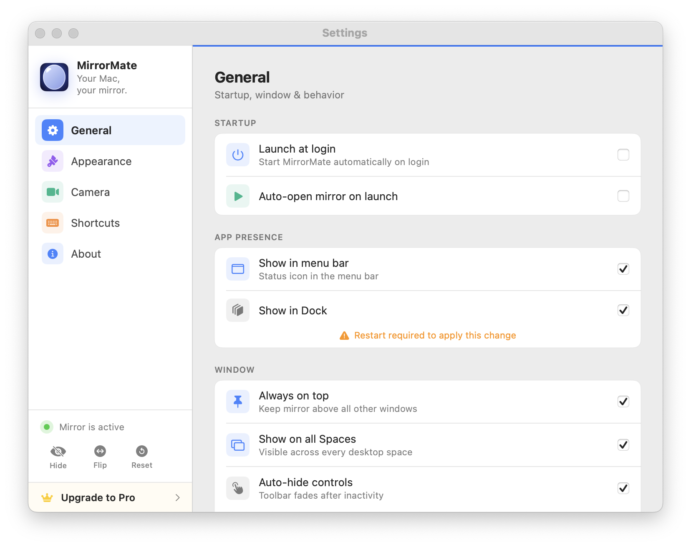
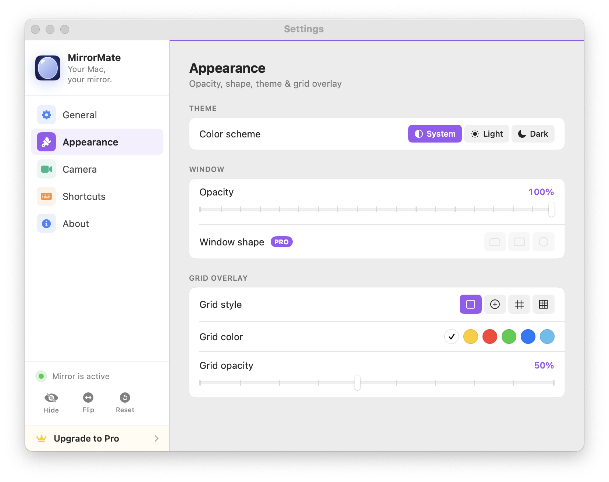
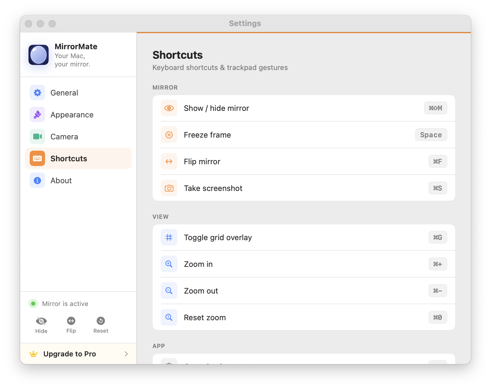
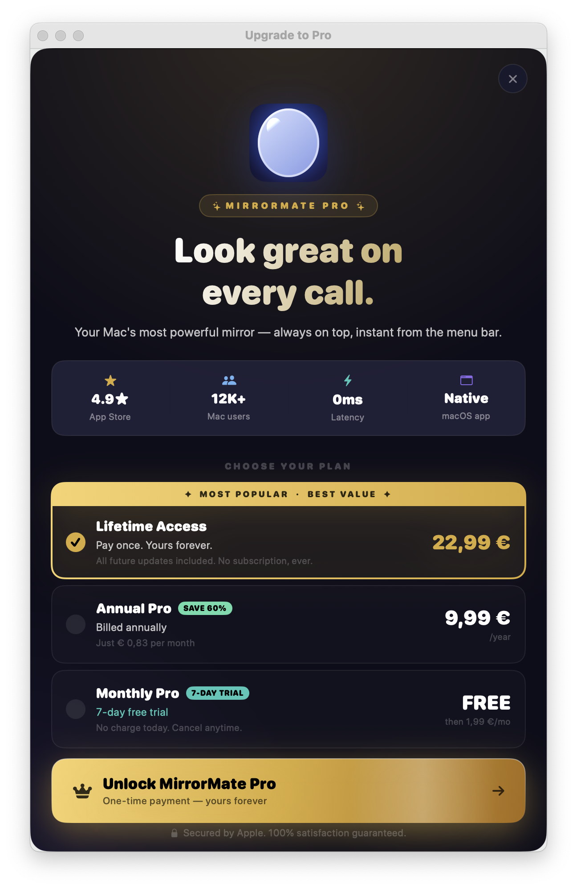

  
  <h1>MirrorMate</h1>
  
<strong>The instant mirror for your Mac — always one shortcut away.</strong>

  
  
  
  
  
  
    

  
  &nbsp;&nbsp;
  

---

## What is MirrorMate?

MirrorMate turns your Mac's camera into an instant mirror — accessible from the menubar or via `⌘⇧M` at any moment. Zero switching, zero friction. The mirror appears in under 50ms and disappears just as fast.

Built for anyone who wants a quick mirror before a Zoom call, presentation, or just to check themselves — without picking up their phone.

**4.9★ on the App Store &nbsp;·&nbsp; 12K+ Mac users &nbsp;·&nbsp; 100% native macOS &nbsp;·&nbsp; < 50ms to open**

---

## Screenshots

<table>
  <tr>
    <td align="center"> <b>General Settings</b></td>
    <td align="center"> <b>Appearance & Grid Overlay</b></td>
  </tr>
  <tr>
    <td align="center"> <b>Keyboard Shortcuts</b></td>
    <td align="center"> <b>MirrorMate Pro</b></td>
  </tr>
</table>

---

## Features

### Free
- **Instant access** — Global shortcut `⌘⇧M` or menubar click, opens in under 50ms
- **Freeze frame** — Press `Space` to pause and examine details
- **Flip** — Toggle horizontal flip with `⌘F`
- **Zoom** — Up to 5× zoom with `⌘+` / `⌘-`
- **Screenshot** — Capture your reflection with `⌘S`
- **Floating window** — Stays on top while you work
- **Multi-Space support** — Works across all Spaces and full-screen apps

### Pro
- **1080p quality** — Highest camera resolution
- **Grid overlays** — Rule of thirds, golden ratio, center guides
- **Video recording** — Record with or without microphone audio
- **Before/After comparison** — Freeze and compare two moments side by side
- **Multi-camera support** — Switch between built-in and external cameras
- **Custom window shape** — Rounded, square, or circular
- **Window opacity** — Adjust transparency to your preference

---

## Keyboard Shortcuts

| Shortcut | Action |
|----------|--------|
| `⌘⇧M` | Show / hide mirror |
| `Space` | Freeze / unfreeze frame |
| `⌘F` | Flip mirror horizontally |
| `⌘G` | Toggle grid overlay |
| `⌘+` | Zoom in |
| `⌘-` | Zoom out |
| `⌘0` | Reset zoom |
| `⌘S` | Take screenshot |
| `⌘,` | Open settings |

---

## Tech Stack

| Layer | Technology |
|-------|-----------|
| UI | SwiftUI + AppKit (`NSPanel`, `NSStatusBar`) |
| Camera | AVFoundation (`AVCaptureSession`, up to 1080p) |
| State | Combine + `@MainActor` |
| Payments | StoreKit 2 — Lifetime, Annual, Monthly |
| Architecture | MVVM — `MirrorViewModel`, `CameraManager`, `AppCoordinator` |
| Persistence | `UserDefaults` + `@AppStorage` |

The camera session pauses automatically when the mirror is hidden — zero CPU/GPU overhead when idle.

---

## Privacy

- No network requests — ever
- No analytics or tracking
- Camera activates only when the mirror window is open
- No data stored or transmitted anywhere

---

## Requirements

- macOS 13.0 (Ventura) or later
- Any built-in or external camera
- ~10 MB disk space

---

   
  Built solo as an indie macOS product.
    
  <strong>Philippe Godfroy</strong>
   
  <a href="https://github.com/KippieG">github.com/KippieG</a> &nbsp;·&nbsp; <a href="https://mirrormateapp.com">mirrormateapp.com</a>
    
  This repository is a public showcase. Source code is private.

